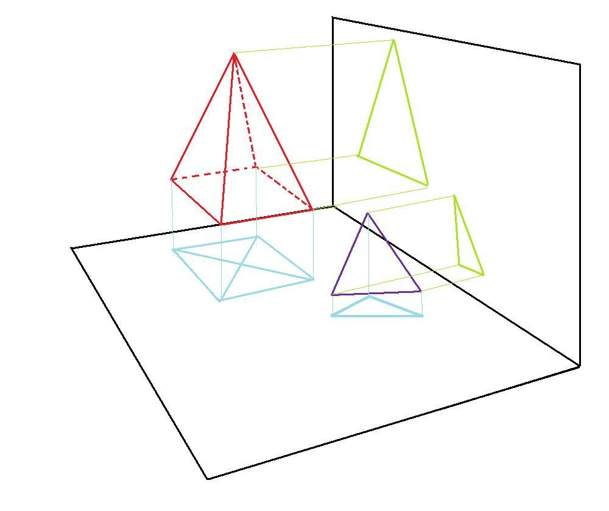

# Projection Project in OpenGL

This project demonstrates the use of orthogonal and perspective projections in an OpenGL environment. The program renders a cube and allows the user to switch between projection modes and interact with the visualization using the keyboard.

## Features

- Rendering a cube using OpenGL.
- Switching between orthogonal and perspective projection.
- Control of rotation and translation of the cube via the keyboard.

## Requirements

- OpenGL
- GLUT (OpenGL Utility Toolkit)

## Compilation and Execution

1. Install the necessary libraries (on Unix-based systems):
    ```bash
    sudo apt-get install freeglut3-dev
    ```

2. Compile the source code:
    ```bash
    gcc -o projection projection.c -lGL -lGLU -lglut -lm
    ```

3. Run the program:
    ```bash
    ./projection
    ```

## Keyboard Controls

- `ESC`: Exit the program.
- `q`: Switch to orthogonal projection.
- `e`: Switch to perspective projection.
- `w`: Move the view to the right.
- `s`: Move the view to the left.
- `d`: Rotate the view to the right.
- `a`: Rotate the view to the left.

## Projection Examples

The image below illustrates an example of orthogonal and perspective projection, showing how different geometric figures are represented in each mode:



## Main Functions

### `void Perspectiva_direcaoX(GLdouble angulo, GLdouble propocao, GLdouble Dproximo, GLdouble Dlonge)`

Configures the perspective projection in the X direction.

### `void Ortogonal(GLdouble xmin, GLdouble xmax, GLdouble ymin, GLdouble ymax, GLdouble znear, GLdouble zfar)`

Configures the orthogonal projection.

### `void desenha()`

Main drawing function that renders the cube.

### `void remodelar(int w, int h)`

Configures the viewport and projections according to the window size.

### `void keyboard(unsigned char key, int x, int y)`

Keyboard input callback function, allows changing projection modes and manipulating the cube's visualization.

## Author

- Thiago Monteles

## License

This project is licensed under the MIT License. See the [LICENSE](LICENSE) file for more details.
